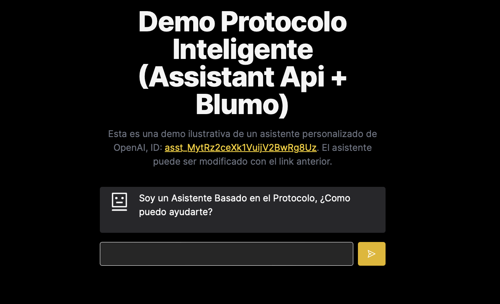

# OpenAI Assistant Starter Kit

Try the live version of this application by visiting:

[OpenAI Assistant Starter Kit Darkmode Demo](https://blumo-assistant-reskin.vercel.app)

Based on  **OpenAI Assistant Starter Kit** 

* Streaming OpenAI Assistant responses from the server to deliver realtime responses.
* Customizing the appearance and behavior of your OpenAI chat application.
* Handling a long thread of messages without losing context.
* Designing an OpenAI app to work on both mobile and desktop.

This Starter Kit was built using NextJS + ReactJS + TypeScript + OpenAI. 

- Credit to [Superexpert](https://github.com/Superexpert/openai-assistant-starter-kit)

